# [myScheduleShare](https://myscheduleshare.com)

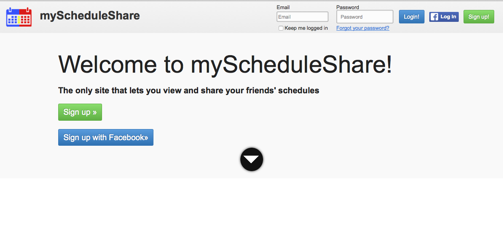
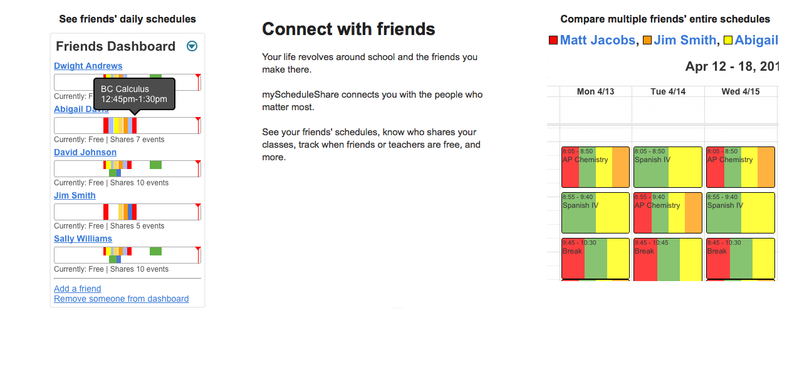
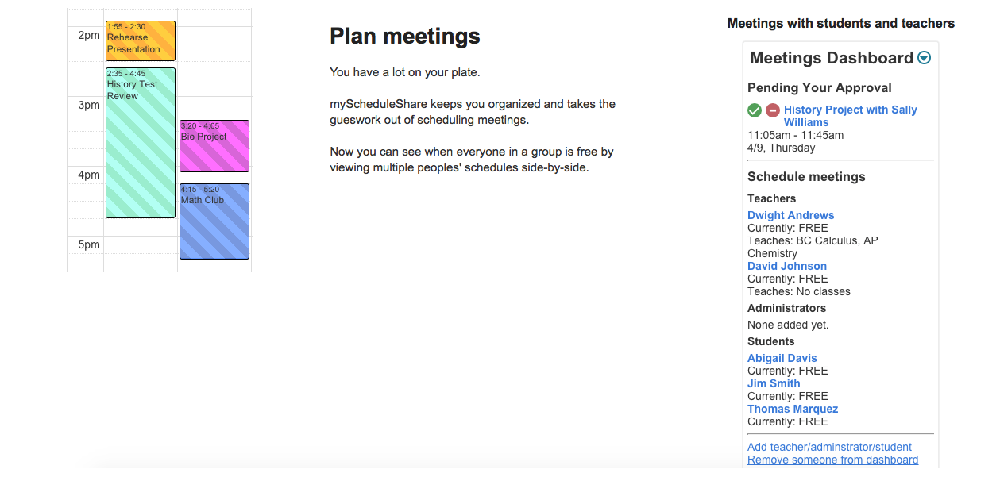
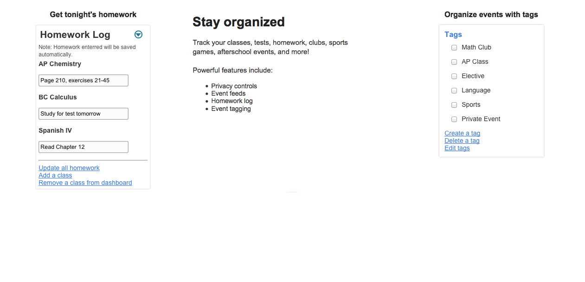

## Inspiration

myScheduleShare began as CPS Schedule Share (cpsscheduleshare.atwebpages.com), which I started developing the summer before 10th grade. There is no central repository of students' schedules at my school, and it was frustrating not being able to see who was in my classes over the summer. So, I decided to build a website that allowed students to share their schedules, as the name suggests.

After building CPS Schedule Share, I turned my attention to building other websites from the ground up, like Debate Nirvana (debatenirvana.com). After spending a few months learning the more advanced concepts and commands of PHP, Javascript, and mySQL by building these websites, I decided to turn my attention back to the idea that sparked CPS Schedule Share, a school-centric calendar that enabled collaboration and sharing between students, teachers, and school administrators.

This new incarnation of CPS Schedule Share would have more powerful features, have faster performance, and most importantly be school-agnostic (e.g. anyone could use the website, not just students at my school, CPS).

I started development of myScheduleShare.com at the beginning of 11th grade, and finished my first Beta version of the site a year later, in August, 2015.

##Core Challenges

###Building a Calendar Engine from Scratch with More Features than Google Calendar

####Month View
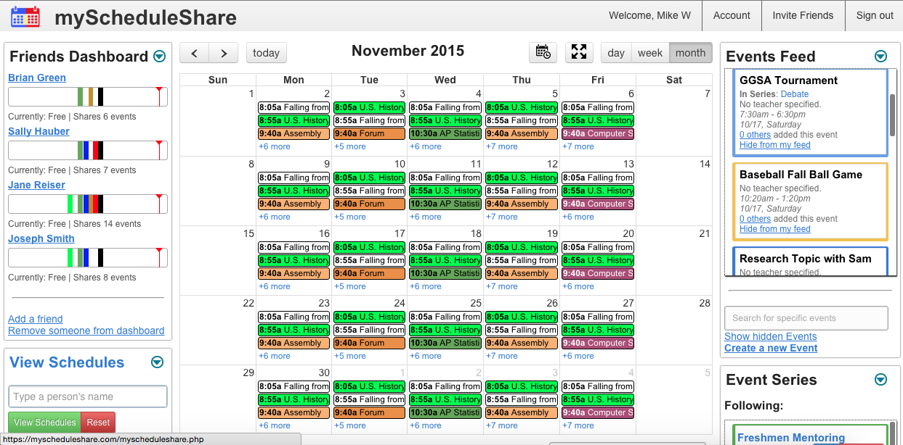
####Week View
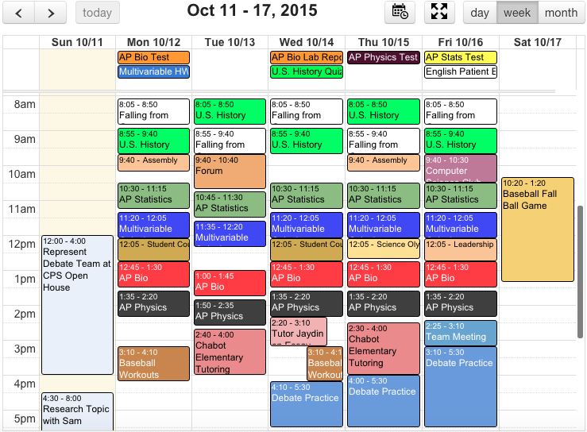
####Day View
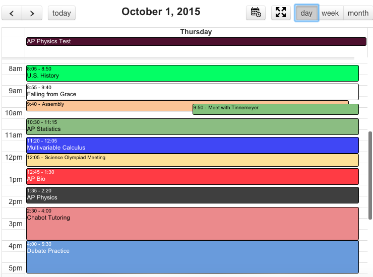

The look and feel of myScheduleShare's Calendar was relatively easy to create - I used a free library called "FullCalendar" as the foundation, upon which I could program more powerful and flexible customizations using Javascript and CSS.

However, the "brains" of myScheduleShare's Calendar, the storing, manipulating, and rendering of Calendar Events, was much more difficult to create, since I had to build it entirely from scratch with PHP and mySQL. I modeled the Calendar after Google Calendar, and tried to reverse engineer as many features as possible. I modified, removed, and added features to fit the "school-centric" theme of myScheduleShare - for example, I added input for "Homework" and "Teacher of Class," fields that make sense on myScheduleShare but not on Google Calendar.

The hardest part of building a fully functional Calendar back-end was allowing Events to recur. For example, a class might repeat every 2 weeks from 8:00-8:45am on Monday, Tuesday, and Friday, but from 9:00-10:30am on Wednesday and Thursday. Or, a club might meet on the third Sunday every two months, but end after meeting 18 times. As you can probably tell, there is a lot of complexity when it comes to dealing with recurring events. But these are especially important for a "school-centric" scheduling application like myScheduleShare - classes often repeat at different times on different days, and a Calendar that can't handle this simple fact isn't fully functional.

Unfortunately, I couldn't just reverse engineer Google Calendar to solve this issue of repeating events. Google Calendar, it turns out, can't handle Events that repeat at different times on different days! Try it out for yourself. If your school has a bell schedule that has classes occurring at different times on different days (like most schools have), Google Calendar won't be able to have your Math class repeat every week from 8-9 on Monday, Wednesday, and Friday, but from 9-10 on Tuesday and Thursday. 
To solve this, I had to be a bit more creative when coming up with a database design to store myScheduleShare's Calendar Events, and write PHP code that could quickly handle the many ways in which events can repeat and determine whether an Event fell within the time range that the user's Calendar was showing.

myScheduleShare can handle every type of Event Google Calendar and Microsoft Outlook can handle, plus more complex types of events (like repeating at different times on different days).

###Edit Event
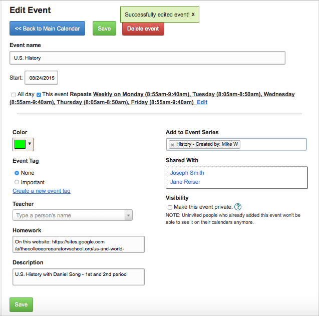
####Recurring Events
#####Weekly
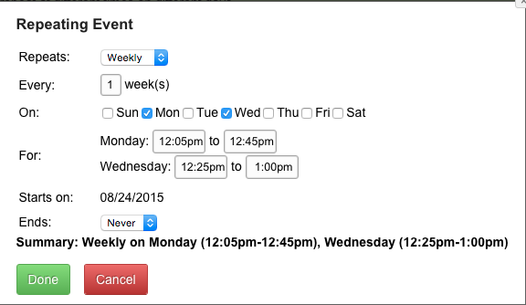
#####Monthly
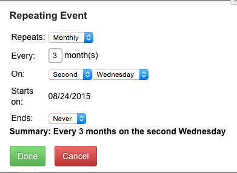
#####Yearly
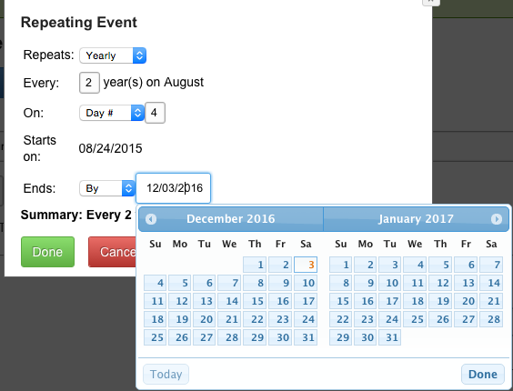

###Compare Schedules of Multiple Users, Side-By-Side

Another powerful feature of myScheduleShare is its ability to compare many users' schedules side-by-side, enabling a user to see when his/her friends are free, what classes others share, and what the best time to schedule a meeting would be.

It took a while to implement code that efficiently fetched dozens of users' schedules at a time, then determined which Events they shared and color-coded them appropriately. I ended up having PHP send a JSON string to the user's browser, then having Javascript color code the Events with some fancy math and HTML and CSS tricks.

####Week View
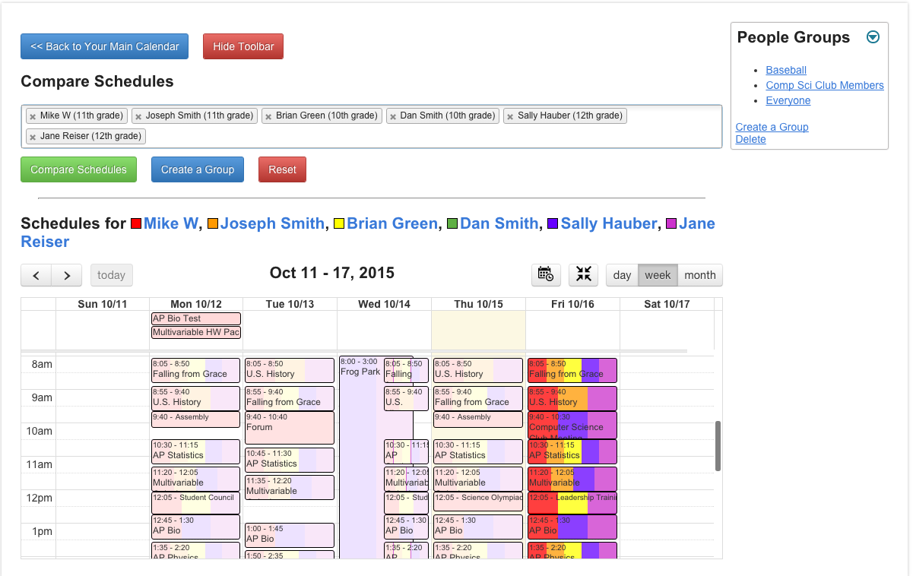
####Month View
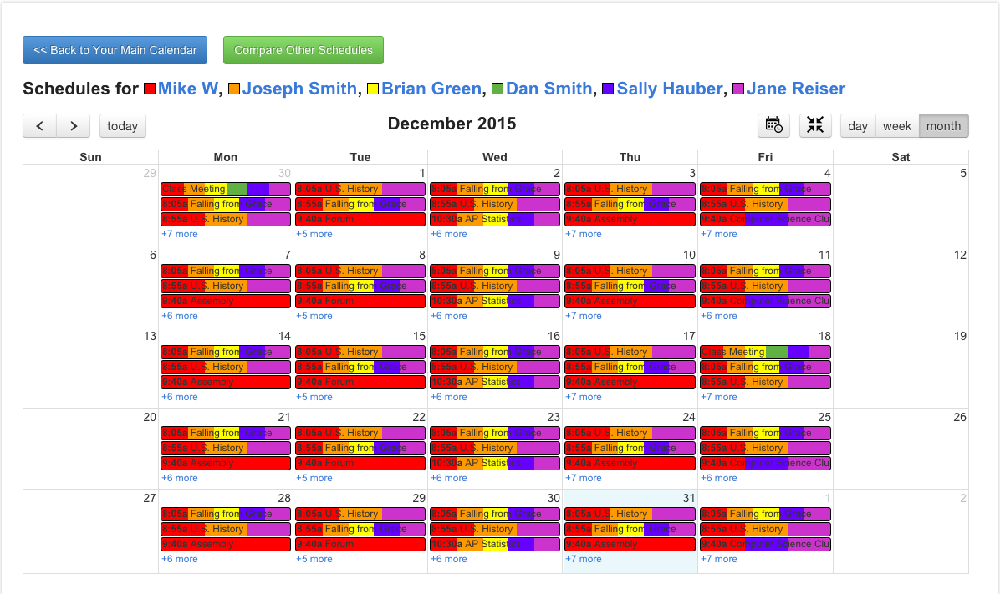
####Day View

###Daily Snapshot of Friends' Schedules

The "Friends Dashboard" feature allows a user to see his/her friends' schedule for today.

I quickly ran into the problem of Events that overlapped - If "Lunch" was from 11-12, but "Meet with Teacher" was from 11:30-11:45, the "Lunch" event would completely hide the "Meet with Teacher" event, or the "Meet with Teacher" event would land right in the middle of "Lunch," which looked ugly and made "Lunch" seem like it was composed of two distinct events that occurred right before and after "Meet with Teacher."

To solve this, I created an algorithm that "stacked" overlapping Events into two separate rows, so that no two Events in the same row occupied the same interval of time. To minimize the space that this process would take up, I optimized the algorithm to utilize as few rows as possible in displaying all of a user's Events so that they did not overlap.

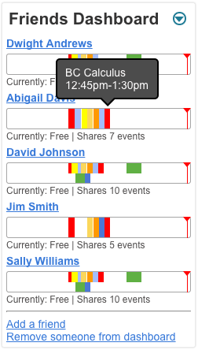

###Flexible Privacy Controls

Privacy Controls were the final feature that I added before releasing myScheduleShare's Beta version. Being able to make an Event private, then Invite certain people to that Event and prohibit everyone else from viewing that Event was surprisingly hard to program. Every time an Event was fetched from the database, it had to have its "visibility" checked, to ensure that the Privacy Controls put on that Event were being followed.

The most difficult implementation of Privacy Controls was in the "Compare Schedules" feature of the website, which allows a user to compare multiple peoples' schedules (including his/her own) side-by-side. Accurately checking the Privacy Controls on each user's Events, then cross-checking that with the user who was currently using the "Compare Schedules" feature, was hard to comprehensively implement. Diagramming my thought process on paper was extremely helpful in resolving this issue.

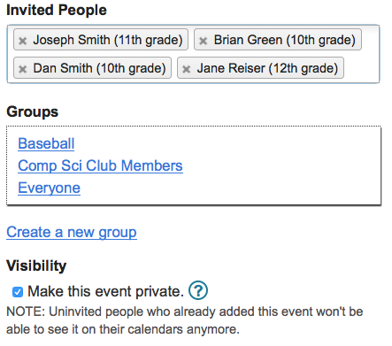

###Dashboards
#####Homework Log
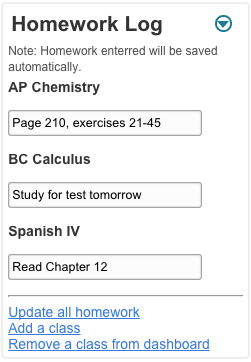

###Edit Profile
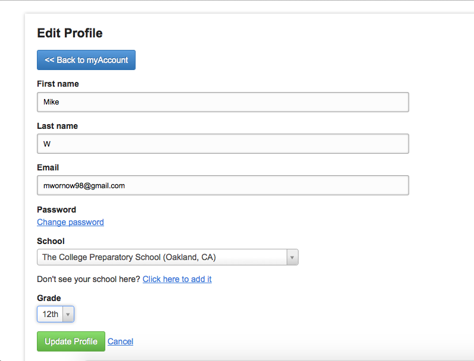

###Event View
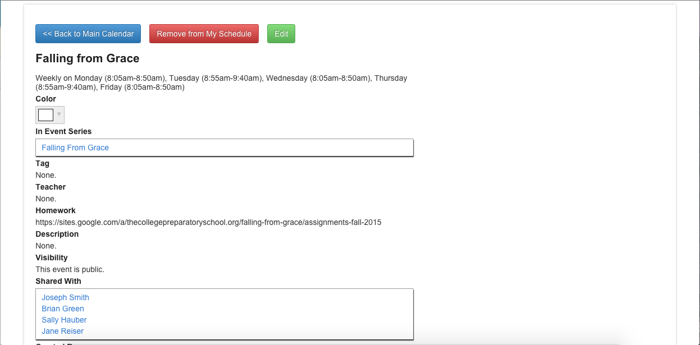

###Sign Up Page
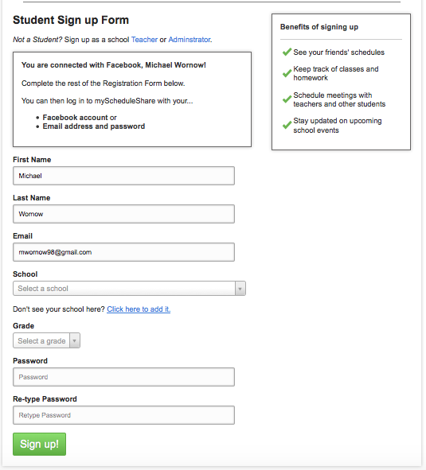

## Selected Code
* Javascript
  * _functions.js_ - The front-end backbone of myScheduleShare. Contains most of the functions and objects used in other Javascript scripts.
* PHP
  * _cleanfunctions.php_ - The back-end backbone of myScheduleShare. Contains most of the functions used in other PHP scripts. Has been trimmed significantly to contain only the Event Rendering logic and simpler utility funtions.
  * _secureclasses.php_ - Contains all the PHP classes used in the website, including:
    * _JSONEncodable_ - Base class of JSON encodable arrays and objects.
    * _IDname_ - Basic object containing an Integer ID, a String Name, and an Array of extra Info.
    * _Person_ - A member of myScheduleShare.
    * _PersonGroup_ - A group of Person objects. Contains meta information about the Group.
    * _EventTag_ - A tag for an event. Has Name, Color, ColorEvents (if this is set to 1, every event with this tag will have this tag's Color), and ScheduleEvents (array of event IDs it has tagged) properties.
    * _EventSeries_ - An EventSeries, which is used to link a set of Events (ScheduleEvent objects) under one common "series" of events. If "Baseball" was an EventSeries, it would have "Game on Wednesday", "Game on Thursday", and "Practice" as Events.
    * _ScheduleEvent_ - An Event. The largest and most used class, with dozens of properties.
    * _RecursObj_ - An object storing the recurring information of a ScheduleEvent object. Used for Events that occur more than once, e.g. once every two months on a Friday, or weekly on Thursday and Saturday.
    * _Paginator_ - Used to create Pagination below the "myEvents Dashboard" of myscheduleshare.php
